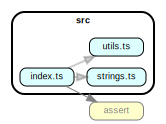

# notionapi-agent

  

Unofficial Node.js API client for [Notion.so](https://www.notion.so).

> This is a work-in-progress project. If you need to use Notion's API in production, I recommend waiting for their official release.

## Installation

```bash
# Install latest release from NPM registry.
npm install notionapi-agent
```

## Getting Started

You can also take a look at [the test script](https://github.com/dragonman225/notionapi-agent/blob/master/test/index.spec.ts).

Or the [documentation](https://notionapi.netlify.com/classes/_index_.notionagent.html).

## Announcement

### [2019.11.01]

New documentation [here](https://notionapi.netlify.com/classes/_index_.notionagent.html).

### [2019.10.13]

I finished TypeScript definitions for all APIs exposed by this agent. Hope this will make development easier !

### [2019.10.08]

When using v0.6.0+, import this library with

```javascript
const { NotionAgent } = require('notionapi-agent')
```

Instead of

```javascript
const NotionAgent = require('notionapi-agent')
```

## Development

### Project Structure



### External Dependencies

* [TypeStrong/typedoc](https://github.com/TypeStrong/typedoc)

  ```bash
  npm i -g typedoc
  ```