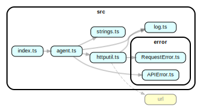

# notionapi-agent

  

Unofficial Node.js API client for [Notion.so](https://www.notion.so).

> ⚠ If you need to use Notion's API in production, I recommend waiting for their official release.

* [CHANGELOG](CHANGELOG.md)
* [API Documentation](https://notionapi.netlify.com/globals.html)

## Installation

```bash
npm install notionapi-agent
```

## Getting Started

### Basic Usage

[](https://npm.runkit.com/notionapi-agent)

```typescript
const { createAgent } = require("notionapi-agent")

const agent = createAgent()

async function main() {

  const pageId = "181e961a-eb5c-4ee6-9153-07c0dfd5156d"

  try {
    const result = await agent.getRecordValues({
      requests: [{ id: pageId, table: "block" }]
    })
    console.log(result)
  } catch (error) {
    console.log(error)
  }

}

main()
```

The `result` is always the response of a successful request (HTTP status `200 OK`). If Notion responds with other status code or the request failed, an error is thrown.

### Advanced Usage

There is an [example](documentation/examples/download-page.ts) to demonstrate how to download all blocks of a page.

To access private content, one need the [token](documentation/get-token/get-token.md).

## Development

### Project Structure



### Documentation

Use [TypeStrong/typedoc](https://github.com/TypeStrong/typedoc) to generate reference documentation. It needs to be installed globally.

```bash
npm i -g typedoc
```

### Packaging

Use [rollup/rollup](https://github.com/rollup/rollup) to package multiple source files into one `cjs` module (`dist/index.js`) and one `esm` module (`dist/index.esm.js`). Use `tsc --emitDeclarationOnly` to generate TypeScript declaration files.